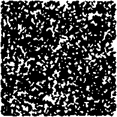

# Telegram dungeon explorer bot
## _Генератор карты_
Если кому-то интересно, то построен он так - сначала берется псевдослучайная матрица.
Затем `automataIteration()` каждый раз с помощью клеточного автомата проверяет соответствует ли эта карта паттерну и "сглаживает углы". Помимо этого она убирает лишние торчащие из воздуха блоки.
Результат примерно такой:

Карта 100 x 100, сглаживание 3 раза, 1000 итераций клеточного автомата.
## _Как использовать_
В файле 'main.py' есть функция `generate()`, которая принимает 3 аргумента:
* `width` - ширина карты
* `height` - высота карты
* `iterations` - количество итераций клеточного автомата

## _А что по времени работы?_
График зависимости времени работы от размера карты:

Как мы видим, время не превышает 0.3 секунды даже на карте 300 x 300.

## _Как я предпологаю использовать это?_
Вообще, поскольку карта генерируется достаточно быстро, по нажтию кнопок карту вполне можно перегенерировать и перемещать игрока по ней. Но я предпологаю, что это будет использоваться для генерации карты, которая будет храниться в базе данных и использоваться для игры.
Или можно было бы кешировать карты, но это уже другая история.
Вот так я представляю архитектуру:
